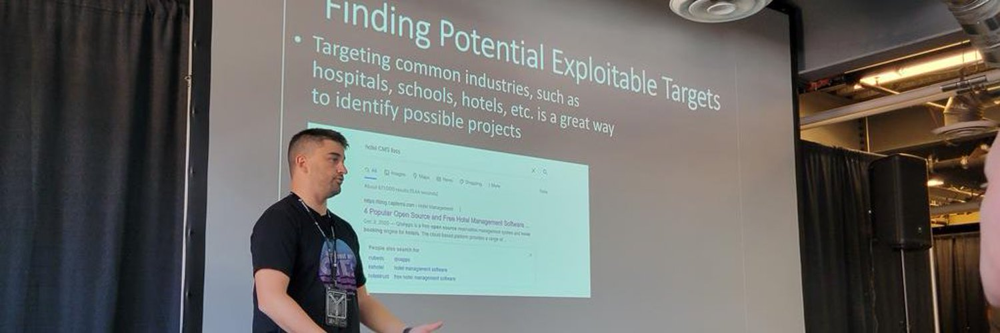

  

Hey everyone. I'm TheMayor, aka Joe Helle. I'm the Chief Hacking Officer and Red Team Lead at TCM Security. 

- 👀 I’m interested in paramotoring, hacking, and family
- 🌱 I’m currently chasing my tail

### Note ⚠️⚠️⚠️
I generally do not accept commits or changes to my projects. While I appreciate you taking the time to want to improve my code with your ideas, these are projects I've created for myself and choose to share with others. On occasion I accept changes when it is something I feel would be a benefit to my own use of the tool, otherwise I generally deny them. 

<!---
dievus/dievus is a ✨ special ✨ repository because its `README.md` (this file) appears on your GitHub profile.
You can click the Preview link to take a look at your changes.
--->
